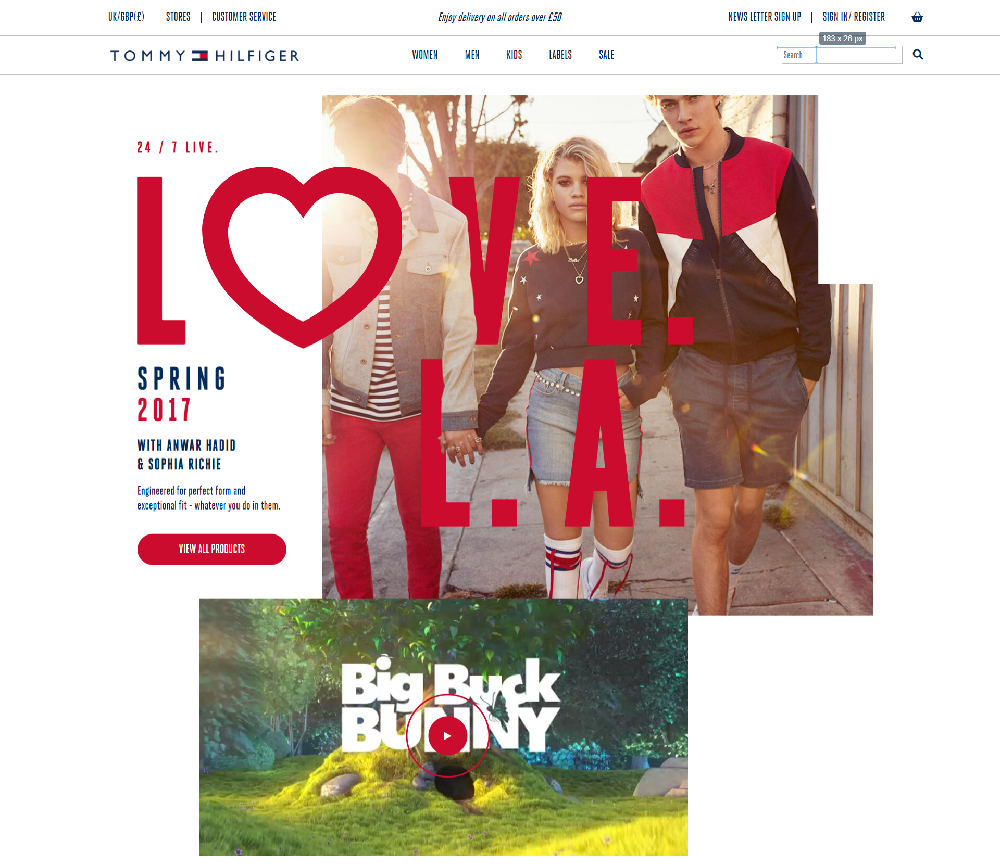

# Media.Monks - Immersive Web Challenge

## Traineeship Recruitment Challenge

---

Welcome, you are about to be faced with the traineeship coding challenge. This is designed to give us an understanding of you current abilities and provide you with an interesting challenge and introduction to some of the work you will be doing.

## Assignment

---

Your assignment for today is to replicate the intro of the homepage of a website we have already built.

In this particular case it is the landing page of the _Tommy Hilfiger's Denim_ campaign website.

You can mock data like copy, but everything should look and function as showcased in the _Motion Example_.

You have to provide the structure, style, animations and custom logic.

This includes:

- HTML structure, CSS styling and JS logic.
- Animations for text, images and blocks.

Bonus points:

- Custom video player with custom controls.
- Responsive layout

- [Overview](#overview)
  - [Screenshot](#screenshot)
  - [Links](#links)
- [My process](#my-process)
  - [Built with](#built-with)
- [Author](#author)

### Screenshot

### Links

- Live Site URL: [live site URL here](https://smulcode.github.io/challenge)

## My process

### Built with

- Semantic HTML5 markup
- CSS custom properties
- CSS Grid
- SCSS
- JavaScript
- GSAP

## Author

[Wesley Smulders]
